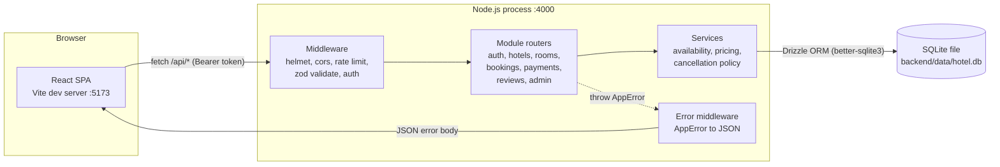
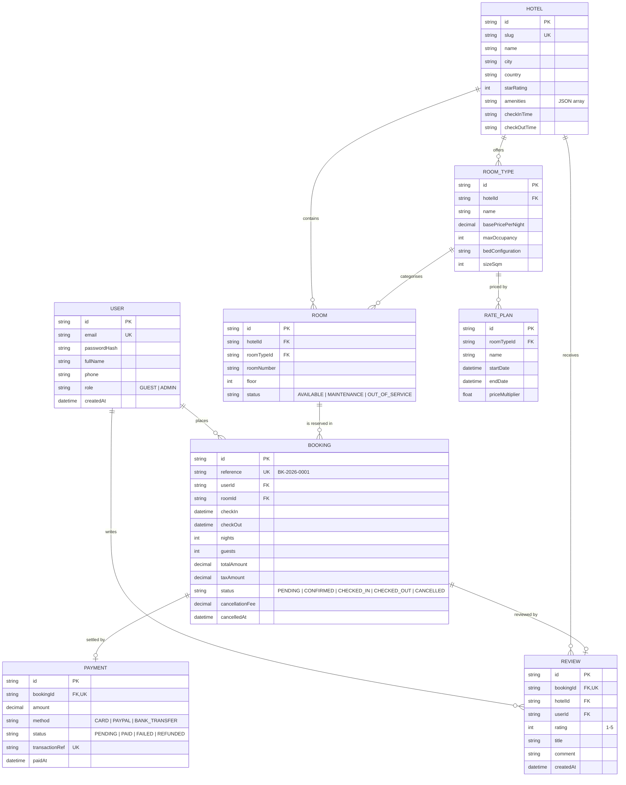

# Hotel Booking System

A complete, runnable hotel booking application: an Express + Drizzle ORM API over a local SQLite
database, and a React single page app for guests and staff. Search real availability across five
properties, get a per-night price breakdown that respects seasonal rate plans, pay through a
simulated provider, and manage the resulting bookings from a guest account or an operations
dashboard.

Everything runs locally with `npm install` and two database commands. There are no cloud services,
no API keys and no paid dependencies.

[](https://nodejs.org)
[](https://www.typescriptlang.org)
[](https://expressjs.com)
[](https://orm.drizzle.team)
[](https://www.sqlite.org)
[](https://react.dev)
[](https://vitejs.dev)
[](https://vitest.dev)
[](LICENSE)

---

## Features

**For guests**

- Availability search by city, date range and party size, with results priced for the exact stay.
- Per-night price breakdown: base rate, seasonal rate plan multiplier, taxes, and the total.
- Room and hotel detail pages with amenities, bed configuration, house rules and guest reviews.
- Checkout with lead-guest details, special requests and a simulated card payment.
- Human-readable booking references (`BK-2026-0001`) and a bookings area with self-service
  cancellation, including an up-front statement of any cancellation fee.
- Account registration and sign-in with JWT access tokens.

**For staff**

- Operations dashboard: occupancy for today, arrivals and departures, revenue booked versus
  collected, average booking value, six-month revenue history and a live booking-status breakdown.
- Booking management with validated status transitions (a cancelled booking cannot be checked in).
- Room inventory management, including taking a room out of service and room CRUD over the API.

**Engineering**

- Half-open interval availability logic - a stay is `[checkIn, checkOut)`, so the guest checking
  out on the 10th and the guest arriving on the 10th never collide.
- Double-booking prevention: availability is re-checked inside the same transaction that writes
  the booking, and the loser of a race receives `409 Conflict`.
- All money handled as integer minor units in code and stored as 2-decimal `NUMERIC` values; no
  float arithmetic anywhere in the pricing path.
- Typed `AppError` hierarchy plus a single error middleware; every async route is wrapped so a
  rejected promise can never become an unhandled rejection.
- Zod validation on every request body, query string and route parameter, mirrored client side.
- `strict: true` TypeScript in both workspaces, with `noUncheckedIndexedAccess` enabled.

---

## Tech stack

| Layer | Choice | Why |
| --- | --- | --- |
| Runtime | Node.js 20.19+, 22 or 24 | Current LTS lines; prebuilt SQLite binaries exist for each. |
| Language | TypeScript 6 (`strict`) | Types are the specification here. |
| API | Express 5 | Small, explicit, no framework magic. |
| ORM | Drizzle ORM + drizzle-kit | Typed SQL-like queries and plain `.sql` migrations, no engine binaries to download. |
| Database | SQLite via better-sqlite3 | Genuinely local: one file, zero services; prebuilt binaries, no compiler needed. |
| Validation | Zod 4 | One schema drives runtime checks and static types. |
| Auth | jsonwebtoken + bcryptjs | Standard JWT access tokens, bcrypt password hashing. |
| Logging | pino + morgan | JSON logs in production, access logs piped into the same stream. |
| Hardening | helmet, cors, express-rate-limit | Sensible defaults on every response. |
| Frontend | React 19 + Vite 8 | Fast dev server, no bundler configuration to maintain. |
| Routing | React Router 7 | Nested layout routes and route guards. |
| Data fetching | TanStack Query 5 | Caching, retries and request de-duplication. |
| Styling | Plain CSS with design tokens | No Tailwind, no component library, reproducible build. |
| Testing | Vitest + Supertest | Unit tests for the domain logic and form validation, HTTP tests for the flows. |

---

## Architecture



Requests flow in one direction: a router validates with zod, delegates to a service that owns the
business rule, and the service talks to the database through Drizzle. Nothing below the router layer knows about HTTP,
which is why the pricing, availability and cancellation rules can be unit tested as pure functions.

---

## Project structure

```text
hotel-booking-system/
├── backend/
│   ├── drizzle/                     # Generated SQL migrations + snapshots
│   ├── src/
│   │   ├── config/
│   │   │   ├── env.ts               # Zod-validated process.env, fails fast
│   │   │   └── logger.ts            # pino logger + morgan stream adapter
│   │   ├── db/
│   │   │   ├── schema.ts            # Tables, indexes, relations (Drizzle)
│   │   │   ├── client.ts            # better-sqlite3 connection, pragmas, migrator
│   │   │   ├── errors.ts            # SQLite constraint error helpers
│   │   │   ├── migrate.ts           # npm run db:migrate
│   │   │   ├── seed.ts              # Deterministic demo data (npm run db:seed)
│   │   │   └── reset.ts             # npm run db:reset
│   │   ├── domain/enums.ts          # Status unions and allowed transitions
│   │   ├── errors/AppError.ts       # AppError + typed subclasses
│   │   ├── middleware/
│   │   │   ├── auth.ts              # requireAuth, requireRole, ownership guard
│   │   │   ├── errorHandler.ts      # Central error to JSON translation
│   │   │   ├── notFound.ts
│   │   │   ├── rateLimit.ts
│   │   │   └── validate.ts          # Zod guards + typed accessors
│   │   ├── modules/
│   │   │   ├── admin/               # stats, booking management, room CRUD
│   │   │   ├── auth/                # register, login, profile
│   │   │   ├── bookings/            # create, list, cancel, DTO mapper
│   │   │   ├── hotels/              # list, detail, cities
│   │   │   ├── payments/            # simulated provider
│   │   │   ├── reviews/             # write and read reviews
│   │   │   └── rooms/               # availability search, availability.ts
│   │   ├── utils/
│   │   │   ├── asyncHandler.ts      bookingReference.ts  cancellation.ts
│   │   │   ├── dates.ts             json.ts              jwt.ts
│   │   │   ├── money.ts             password.ts          pricing.ts
│   │   ├── types/express.d.ts       # Request.user augmentation
│   │   ├── app.ts                   # Express app assembly
│   │   ├── routes.ts                # /api router tree
│   │   └── index.ts                 # Bootstrap + graceful shutdown
│   ├── tests/
│   │   ├── availability.test.ts     # Every overlap boundary case
│   │   ├── bookingReference.test.ts
│   │   ├── cancellation.test.ts
│   │   ├── pricing.test.ts
│   │   └── integration/api.test.ts  # Supertest end-to-end flow
│   ├── .env.example
│   ├── drizzle.config.ts
│   ├── package.json
│   ├── tsconfig.json
│   ├── tsconfig.build.json
│   └── vitest.config.mts
├── frontend/
│   ├── src/
│   │   ├── api/                     # client.ts + one module per resource
│   │   ├── components/              # Layout, Header, Footer, SearchBar,
│   │   │                            # DateRangePicker, HotelCard, RoomCard,
│   │   │                            # PriceBreakdown, BookingStatusBadge,
│   │   │                            # ReviewList, StarRating, ProtectedRoute,
│   │   │                            # Spinner, ErrorBanner, EmptyState, Thumbnail
│   │   ├── context/AuthContext.tsx
│   │   ├── hooks/                   # useAuth.ts, useDebounce.ts
│   │   ├── lib/                     # format.ts, validation.ts
│   │   ├── pages/                   # Home, SearchResults, HotelDetail,
│   │   │                            # RoomDetail, Checkout, BookingConfirmation,
│   │   │                            # MyBookings, Login, Register,
│   │   │                            # AdminDashboard, NotFound
│   │   ├── styles/                  # tokens.css + base/layout/components/pages
│   │   ├── types/index.ts           # DTOs mirroring the API
│   │   ├── App.tsx                  # Router, QueryClient, AuthProvider
│   │   └── main.tsx
│   ├── tests/                       # format + validation unit tests
│   ├── .env.example
│   ├── index.html
│   ├── package.json
│   ├── tsconfig.json
│   ├── tsconfig.node.json
│   ├── vite.config.ts
│   └── vitest.config.ts
├── docs/images/                     # Put screenshots here (see Screenshots)
├── .editorconfig
├── .gitignore
├── LICENSE
├── package.json                     # npm workspaces + convenience scripts
└── README.md
```

---

## Prerequisites

| Requirement | Version | Notes |
| --- | --- | --- |
| Node.js | 20.19+, 22.12+ or 24.x | `node --version`. 22 or 24 LTS recommended. |
| npm | 10 or newer | Ships with Node; workspaces are required. |
| Disk | ~200 MB | Dependencies plus the SQLite file. |

No database server, Docker daemon or cloud account is needed. SQLite is a single file,
`backend/data/hotel.db`, created on first run.

**No C++ toolchain on Windows.** The SQLite driver, `better-sqlite3`, is a native module, but it is
pinned to `~12.9.0`, whose releases ship prebuilt binaries for win32-x64 (and macOS/Linux) on
Node 20, 22 and 24. `npm install` downloads the matching binary from the project's GitHub
releases; Visual Studio Build Tools are only needed on an unusual platform or Node version with
no prebuilt binary.

---

## Installation

Windows PowerShell or Command Prompt, macOS and Linux all use the same commands.

```bash
git clone https://github.com/your-org/hotel-booking-system.git
cd hotel-booking-system
```

**1. Install every workspace from the repository root** (npm workspaces links `backend` and
`frontend` in one pass):

```bash
npm install
```

**2. Create the backend environment file.**

PowerShell:

```powershell
Copy-Item backend\.env.example backend\.env
```

Command Prompt:

```cmd
copy backend\.env.example backend\.env
```

macOS or Linux:

```bash
cp backend/.env.example backend/.env
```

Then open `backend/.env` and replace `JWT_SECRET` with a long random string. Nothing else has to
change for local use.

**3. Create the frontend environment file** (optional - the default proxy works without it):

```powershell
Copy-Item frontend\.env.example frontend\.env
```

**4. Create the database and load the demo data:**

```bash
npm run db:migrate
npm run db:seed
```

**5. Start both servers:**

```bash
npm run dev
```

| URL | What it is |
| --- | --- |
| http://localhost:5173 | React app |
| http://localhost:4000/api/health | API health check |

`npm run setup` runs install, migrate and seed in one go.

### Root scripts

| Script | Description |
| --- | --- |
| `npm run dev` | Runs the API and the SPA together with `concurrently`. |
| `npm run dev:backend` / `npm run dev:frontend` | Run one side only. |
| `npm run build` | Type-checks and builds both workspaces. |
| `npm start` | Runs the compiled API from `backend/dist`. |
| `npm test` | Runs the backend and frontend Vitest suites. |
| `npm run test:coverage` | Same, with a V8 coverage report. |
| `npm run typecheck` | `tsc --noEmit` across both workspaces. |
| `npm run db:migrate` | Applies the SQL migrations in `backend/drizzle/` (the API also does this on start). |
| `npm run db:seed` | Clears the tables and loads the demo data (safe to re-run). |
| `npm run db:reset` | Deletes the database file, re-creates the schema and re-seeds. |

---

## Configuration

### Backend (`backend/.env`)

| Variable | Default | Required | Description |
| --- | --- | --- | --- |
| `DATABASE_FILE` | `./data/hotel.db` | No | SQLite file, resolved relative to `backend/`. `:memory:` is accepted (used by the tests). |
| `PORT` | `4000` | No | API port. |
| `NODE_ENV` | `development` | No | `development`, `test` or `production`. |
| `LOG_LEVEL` | `info` | No | pino level: `fatal` through `trace`, or `silent`. |
| `JWT_SECRET` | none | **Yes** | Token signing key, minimum 16 characters. Supply your own. |
| `JWT_EXPIRES_IN` | `7d` | No | Access token lifetime (`15m`, `12h`, `7d`). |
| `BCRYPT_ROUNDS` | `10` | No | Password hashing cost, 4-15. |
| `CORS_ORIGIN` | `http://localhost:5173` | No | Comma-separated list of allowed origins. |
| `RATE_LIMIT_MAX` | `100` | No | Requests per window per IP across `/api`. |
| `RATE_LIMIT_WINDOW_MINUTES` | `15` | No | Rate limit window length. |
| `TAX_PERCENT` | `12` | No | Tax added to the stay subtotal. |
| `FREE_CANCELLATION_HOURS` | `48` | No | Free cancellation window before check-in. |
| `CANCELLATION_FEE_PERCENT` | `25` | No | Fee charged for a late cancellation. |

Startup validates all of these with zod. A missing or malformed value prints the offending keys and
exits rather than failing later at request time.

### Frontend (`frontend/.env`)

| Variable | Default | Required | Description |
| --- | --- | --- | --- |
| `VITE_API_BASE_URL` | `/api` | No | Leave as `/api` to use the Vite dev proxy; set to a full origin (for example `https://api.example.com/api`) when the API is deployed elsewhere. |

---

## Database

### Commands

```bash
npm run db:migrate                # apply backend/drizzle/*.sql to the database
npm run db:seed                   # clear the tables and load the demo data
npm run db:reset -w backend       # delete the file, migrate and re-seed
npm run db:generate -w backend    # after editing src/db/schema.ts: write a new migration
npm run db:studio -w backend      # optional: browse the data in Drizzle Studio
```

The seed script is deterministic - a fixed PRNG seed and explicit primary keys - and it clears the
tables first, so re-running it always produces the same data set (bookings made through the UI are
removed). Stay dates are generated relative to the day it runs,
so the data always contains past, in-house and future bookings.

It creates: 5 hotels across 5 cities, 3-4 room types each, 8-15 rooms per type (165 rooms; one room
in each type with ten or more is parked in maintenance), 4 seasonal rate plans per room type, 4 users, 30 non-overlapping bookings spread
across every status, matching payments, and reviews on roughly two thirds of completed stays.

### Entity relationships



Indexes cover the columns that availability queries filter on: `bookings(roomId, checkIn, checkOut)`,
`bookings(checkIn)`, `bookings(checkOut)`, `bookings(status)` and
`rate_plans(roomTypeId, startDate, endDate)`.

> **Note on types.** SQLite has no `enum`, `decimal` or JSON column types, so status fields are
> `TEXT`, money columns use `NUMERIC` affinity (converted to integer cents in code), timestamps are
> integer milliseconds and amenity lists are JSON-encoded text. The allowed values live in
> `backend/src/domain/enums.ts` and are enforced by zod at every entry point.

---

## Usage

1. Open http://localhost:5173 and search a destination with a date range.
2. Pick a room from the results - each card shows the average nightly rate and the stay total.
3. Sign in (or use a demo account below) and continue to checkout.
4. Fill in the lead guest details and pay with the pre-filled test card. A card number ending in
   `0000` is always declined, so both paths can be demonstrated.
5. The confirmation page shows the booking reference, the payment record and the stay summary.
6. Open **My bookings** to review or cancel. The cancellation fee, if any, is stated before you
   confirm.
7. Sign in as the administrator to see the operations dashboard, move bookings through their
   lifecycle and take rooms out of service.

### Business rules worth knowing

- **Availability.** A room is free for `[checkIn, checkOut)` when no non-cancelled booking satisfies
  `existing.checkIn < requested.checkOut && existing.checkOut > requested.checkIn`. Same-day
  turnover is therefore allowed.
- **Pricing.** Each night is priced independently: `round(baseRate * ratePlanMultiplier)`, summed,
  then tax is applied to the subtotal. Overlapping rate plans resolve to the most specific window.
- **Cancellation.** Free while more than `FREE_CANCELLATION_HOURS` remain before check-in; after
  that `CANCELLATION_FEE_PERCENT` of the total is retained; once the stay has started nothing is
  refunded.

---

## API reference

Base URL: `http://localhost:4000/api`. All responses are JSON. Authenticated requests send
`Authorization: Bearer <token>`.

| Method | Path | Auth | Description |
| --- | --- | --- | --- |
| `GET` | `/health` | None | Liveness probe with uptime and environment. |
| `POST` | `/auth/register` | None | Create a guest account, returns a token. |
| `POST` | `/auth/login` | None | Exchange credentials for a token. |
| `GET` | `/auth/me` | Bearer | Current profile. |
| `GET` | `/hotels` | None | Paginated hotels; filter by `city`, `country`, `search`, `minStars`. |
| `GET` | `/hotels/cities` | None | Distinct cities with a hotel count, for the search box. |
| `GET` | `/hotels/:slug` | None | Hotel detail with room types and rating summary. |
| `GET` | `/hotels/:slug/reviews` | None | Paginated reviews plus a rating distribution. |
| `GET` | `/rooms/search` | None | Availability search: `city`, `hotelSlug`, `checkIn`, `checkOut`, `guests`, `maxPricePerNight`. |
| `GET` | `/rooms/:id` | None | Room detail; add `checkIn` and `checkOut` for a live quote. |
| `POST` | `/bookings` | Bearer | Create a booking (re-checks availability in a transaction). |
| `GET` | `/bookings/me` | Bearer | The caller's bookings; `scope=all\|upcoming\|past`. |
| `GET` | `/bookings/:reference` | Bearer (owner or admin) | One booking by reference. |
| `POST` | `/bookings/:reference/cancel` | Bearer (owner or admin) | Cancel and return the fee outcome. |
| `POST` | `/payments/:bookingReference` | Bearer (owner or admin) | Simulated payment; confirms the booking. |
| `POST` | `/reviews` | Bearer | Review a completed stay (one per booking). |
| `GET` | `/reviews/me` | Bearer | Reviews written by the caller. |
| `GET` | `/admin/stats` | Admin | Dashboard metrics. |
| `GET` | `/admin/bookings` | Admin | All bookings with filters and search. |
| `PATCH` | `/admin/bookings/:id/status` | Admin | Apply a validated status transition. |
| `GET` | `/admin/rooms` | Admin | Room inventory. |
| `POST` | `/admin/rooms` | Admin | Add a room to a room type. |
| `PATCH` | `/admin/rooms/:id` | Admin | Update number, floor, status or room type. |
| `DELETE` | `/admin/rooms/:id` | Admin | Delete a room that has no booking history. |

Errors always use the same envelope:

```json
{
  "error": {
    "code": "CONFLICT",
    "message": "That room was just booked for those dates. Please pick another.",
    "details": null
  }
}
```

Status codes in use: `400` bad request, `401` unauthenticated, `403` forbidden, `404` not found,
`409` conflict, `422` validation failure, `429` rate limited, `500` internal error.

### Example: sign in

```http
POST /api/auth/login
Content-Type: application/json

{ "email": "guest@example.com", "password": "Guest@123" }
```

```json
{
  "user": {
    "id": "user-guest-1",
    "email": "guest@example.com",
    "fullName": "Marta Kowalski",
    "phone": "+48 12 555 0142",
    "role": "GUEST",
    "createdAt": "2026-01-14T09:12:04.000Z"
  },
  "token": "eyJhbGciOiJIUzI1NiIsInR5cCI6IkpXVCJ9...",
  "expiresIn": "7d"
}
```

### Example: search availability

```http
GET /api/rooms/search?city=Lisbon&checkIn=2026-07-10&checkOut=2026-07-13&guests=2
```

```json
{
  "checkIn": "2026-07-10",
  "checkOut": "2026-07-13",
  "nights": 3,
  "guests": 2,
  "results": [
    {
      "hotel": { "id": "hotel-h1", "name": "Azure Bay Resort", "slug": "azure-bay-resort", "city": "Lisbon", "country": "Portugal", "starRating": 5, "imageUrl": "/images/hotels/azure-bay-resort.jpg" },
      "roomType": { "id": "rt-h1-rt1", "name": "Garden View Double", "basePricePerNight": 145, "maxOccupancy": 2, "bedConfiguration": "1 queen bed", "sizeSqm": 28, "amenities": ["Air conditioning", "Rain shower"], "imageUrl": null, "description": "A calm 28 m2 room opening onto the palm garden." },
      "roomId": "room-h1-rt1-1",
      "availableRoomCount": 9,
      "quote": {
        "nights": [
          { "date": "2026-07-10", "multiplier": 1.35, "amount": 195.75, "ratePlanName": "Peak season" },
          { "date": "2026-07-11", "multiplier": 1.35, "amount": 195.75, "ratePlanName": "Peak season" },
          { "date": "2026-07-12", "multiplier": 1, "amount": 145, "ratePlanName": null }
        ],
        "nightCount": 3,
        "averageNightlyRate": 178.83,
        "subtotal": 536.5,
        "taxPercent": 12,
        "tax": 64.38,
        "total": 600.88
      }
    }
  ]
}
```

### Example: create a booking

```http
POST /api/bookings
Authorization: Bearer <token>
Content-Type: application/json

{
  "roomId": "room-h1-rt1-1",
  "checkIn": "2026-07-10",
  "checkOut": "2026-07-13",
  "guests": 2,
  "specialRequests": "High floor if possible, please."
}
```

```json
{
  "booking": {
    "id": "5b0f4c1e-8a57-4f5e-9d3b-2f6a7c0d9e41",
    "reference": "BK-2026-0031",
    "status": "PENDING",
    "checkIn": "2026-07-10",
    "checkOut": "2026-07-13",
    "nights": 3,
    "guests": 2,
    "totalAmount": 600.88,
    "taxAmount": 64.38,
    "cancellationFee": 0,
    "canCancel": true,
    "cancellation": { "isFree": true, "feeAmount": 0, "refundAmount": 600.88, "freeUntilHoursBeforeCheckIn": 48 },
    "payment": null
  },
  "quote": { "nightCount": 3, "subtotal": 536.5, "tax": 64.38, "total": 600.88 }
}
```

If the room was taken between the search and the submit, the same request returns `409`:

```json
{ "error": { "code": "CONFLICT", "message": "That room was just booked for those dates. Please pick another." } }
```

---

## Demo accounts

Available after `npm run db:seed`.

| Role | Email | Password | What it shows |
| --- | --- | --- | --- |
| Administrator | `admin@example.com` | `Admin@123` | Operations dashboard, booking and room management. |
| Guest | `guest@example.com` | `Guest@123` | Several past, current and upcoming bookings. |
| Guest | `liam@example.com` | `Guest@123` | Secondary guest account. |
| Guest | `yuki@example.com` | `Guest@123` | Secondary guest account. |

Test cards for the simulated payment step: any Luhn-valid number is authorised (for example
`4242 4242 4242 4242`), and any number ending in `0000` is declined.

---

## Screenshots

Screenshots are not committed to keep the repository small. Drop your own into `docs/images/` using
these file names and they will appear here.

| View | File |
| --- | --- |
| Home and search | `docs/images/home.png` |
| Search results | `docs/images/search-results.png` |
| Room detail with price breakdown | `docs/images/room-detail.png` |
| Checkout | `docs/images/checkout.png` |
| My bookings | `docs/images/my-bookings.png` |
| Admin dashboard | `docs/images/admin-dashboard.png` |

```markdown

```

---

## Testing

```bash
npm test                  # backend and frontend suites, once
npm run test:coverage     # backend, with a coverage report in backend/coverage
npm run test:watch -w backend
```

| Suite | File | Covers |
| --- | --- | --- |
| Pricing | `backend/tests/pricing.test.ts` | Minor-unit conversion, per-night rounding, rate plan selection, tax, invalid ranges. |
| Availability | `backend/tests/availability.test.ts` | Every overlap boundary: touching intervals, one-night overlaps, identical, enclosing and enclosed stays, cancelled bookings, stored timestamps with a time component. |
| Cancellation | `backend/tests/cancellation.test.ts` | Free window, the exact cut-off, one minute past it, a started stay, rounding and a zero-hour policy. |
| Booking references | `backend/tests/bookingReference.test.ts` | Formatting, padding, parsing, year rollover, unparsable stored values. |
| Frontend helpers | `frontend/tests/*.test.ts` | Currency/date formatting, Luhn check, password, search and card form schemas. |
| API integration | `backend/tests/integration/api.test.ts` | Register, sign in, search, book, decline and accept a payment, list, cancel, back-to-back stays, the double-booking `409`, ownership `403` and the admin guard. |

The integration suite runs against an in-memory SQLite database (`DATABASE_FILE=:memory:`),
applies the real migrations from `backend/drizzle/`, inserts a few fixtures with Drizzle and
exercises the app with Supertest. Your development database is never touched.

---

## Roadmap

- Refresh tokens with rotation and revocation, so access tokens can be short lived.
- Email confirmations through a pluggable provider interface.
- Multi-currency support - the schema already stores decimal amounts; only the presentation layer
  assumes a single currency.
- Room type level inventory holds, so a room is reserved for a few minutes during checkout.
- Housekeeping status per room and an arrivals/departures worksheet for staff.
- Frontend component tests with Testing Library, plus a Playwright smoke run.
- Optional PostgreSQL datasource for deployments that outgrow a single file.

## Limitations

This is a sample application. It is deliberately honest about what it is not:

- **Payments are simulated.** No provider is contacted, no card data is stored, and the approval
  decision is derived from the card number so both outcomes can be demonstrated.
- **Single currency.** Amounts are displayed in euros; no conversion or per-hotel currency exists.
- **SQLite concurrency.** WAL mode is enabled, but a single-file database is not intended for
  serious write concurrency. Drizzle also supports PostgreSQL, which is the migration path.
- **No email or notifications.** Confirmations exist only on screen.
- **Access tokens only.** A lost token stays valid until it expires; there is no refresh or
  revocation list.
- **Images are placeholders.** Seeded records point at `/images/...` paths that are not included;
  the UI falls back to a tinted panel.
- **Seasonal pricing is simplified.** One multiplier per window, no length-of-stay discounts,
  day-of-week rules or promotional codes.

---

## License

Released under the [MIT License](LICENSE).
